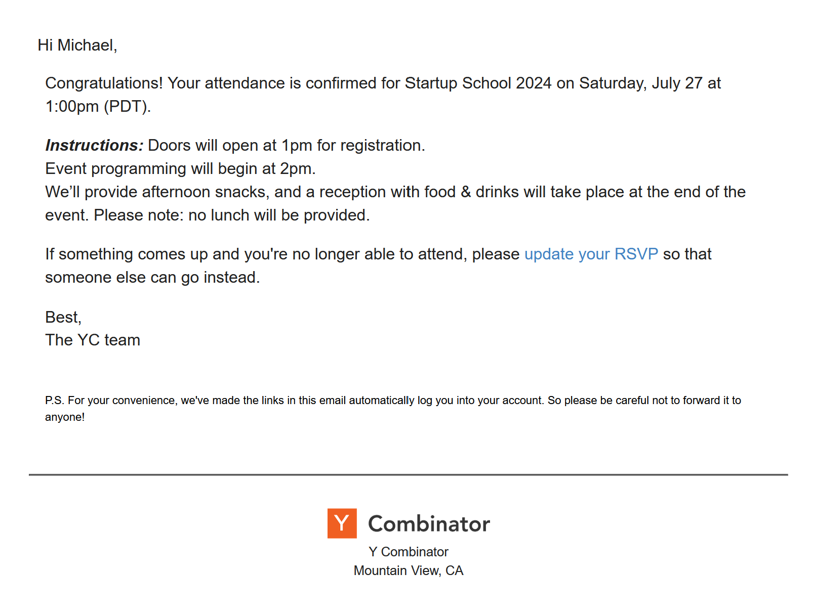

# mailr

Mail spoofing for fun and glory.

## About

I used a forwarded e-mail to get into an event recently.

It got me thinking: isn't e-mail insecure? In short, yes it is.

This repository is my attempt at automatically spoofing e-mails on your local machine.

## TO-DOs

The approach is to create an SMTP/POP3 server without much authentication that a user can sign-in and check (ideally on mobile).

Here's my approach.

1. Run a local mail server for sending mail
    - The server will use SMTP to receiving mail and writing it to disk
    - And then implement POP3 for allowing retrieval of mail
2. Write e-mail to that server from a local SMTP client
    - I can start with `netcat`, and then upgrade to a more fully-featured command line program
    - This should take a sender, receiving, HTML skeleton (that is then formatted), and pass it to the SMTP server
3. Connect K-9 mail (running on my Pixel 8 Pro) to this local server
    - Via POP3, read the mail from this server
4. Profit

At the end of this all, hopefully write a cool blog post [here](./BLOG.md).

## Miscellany

- ["Can I spoof e-mail?"](https://security.stackexchange.com/questions/137780/can-i-spoof-email)
- ["Spoofing e-mail `From` address"](https://security.stackexchange.com/questions/9549/spoofing-email-from-address)
- ["Is zero knowledge possible with web based encrypted email services?"](https://security.stackexchange.com/questions/150985/is-zero-knowledge-possible-with-webbased-encrypted-email-services)
